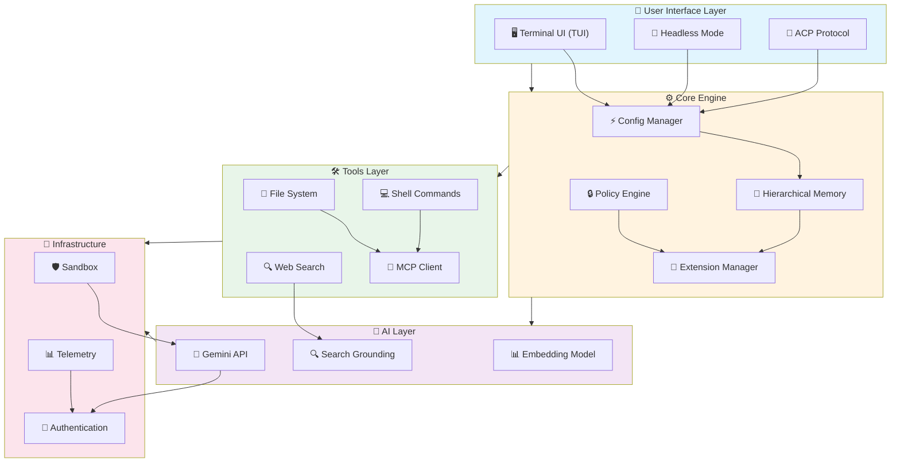
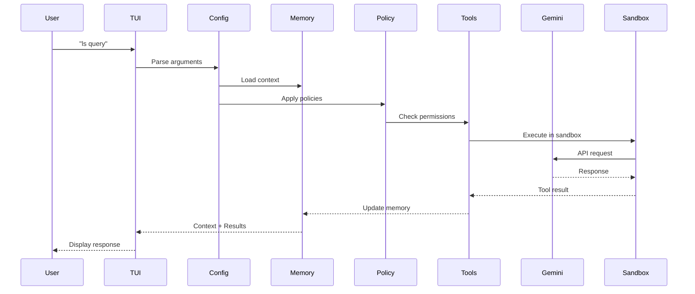

# LS CLI

[](https://github.com/ls-cli/ls-cli/actions/workflows/ci.yml)
[](https://github.com/ls-cli/ls-cli/actions/workflows/chained_e2e.yml)
[](https://www.npmjs.com/package/@ls/cli)
[](https://github.com/ls-cli/ls-cli/blob/main/LICENSE)
[](https://nodejs.org/)
[](https://www.typescriptlang.org/)


> **LS CLI** is an open-source AI agent that brings the power of Gemini directly
> into your terminal. It provides lightweight access to Gemini, giving you the
> most direct path from your prompt to our model.

Learn all about LS CLI in our [documentation](https://lscli.com/docs/).

---

## Table of Contents

- [🚀 Why LS CLI?](#-why-ls-cli)
- [📦 Installation](#-installation)
- [🔑 Key Features](#-key-features)
- [🔐 Authentication](#-authentication)
- [🚀 Getting Started](#-getting-started)
- [⚙️ Configuration](#️-configuration)
- [🏗️ System Architecture](#️-system-architecture)
- [🛠️ Development Stack](#️-development-stack)
- [📊 Project Statistics](#-project-statistics)
- [📚 Documentation](#-documentation)
- [🤝 Contributing](#-contributing)
- [📖 Resources](#-resources)
- [📄 Legal](#-legal)

---

## 🚀 Why LS CLI?

| Feature                | Description                                                            |
| ---------------------- | ---------------------------------------------------------------------- |
| 🎯 **Free Tier**       | 60 requests/min and 1,000 requests/day with personal Google account    |
| 🧠 **Gemini 3 Models** | Access to improved reasoning and 1M token context window               |
| 🔧 **Built-in Tools**  | Google Search grounding, file operations, shell commands, web fetching |
| 🔌 **Extensible**      | MCP (Model Context Protocol) support for custom integrations           |
| 💻 **Terminal-first**  | Designed for developers who live in the command line                   |
| 🛡️ **Open Source**     | Apache 2.0 licensed                                                    |
| ⚡ **Sandboxing**      | Safe execution environment for untrusted code                          |
| 🔄 **Checkpointing**   | Save and resume complex sessions                                       |
| 📁 **Context Files**   | Custom `.gemini.md` files to tailor behavior                           |
| 🔍 **Code Analysis**   | Query and edit large codebases with ease                               |

---

## 📦 Installation

See
[LS CLI installation, execution, and releases](https://www.lscli.com/docs/get-started/installation)
for recommended system specifications and a detailed installation guide.

### Quick Install Methods

#### ▶️ Run instantly with npx

```bash
# Using npx (no installation required)
npx @ls/cli
```

#### 📦 Install globally with npm

```bash
npm install -g @ls/cli
```

#### 🍺 Install globally with Homebrew (macOS/Linux)

```bash
brew install ls-cli
```

#### 🚀 Install globally with MacPorts (macOS)

```bash
sudo port install ls-cli
```

#### 🐍 Install with Anaconda (for restricted environments)

```bash
# Create and activate a new environment
conda create -y -n ls_env -c conda-forge nodejs
conda activate ls_env

# Install LS CLI globally via npm
npm install -g @ls/cli
```

---

## Release Channels

See [Releases](https://www.lscli.com/docs/changelogs) for more details.

### 📌 Preview Release

> New preview releases published each week at UTC 23:59 on Tuesdays.

```bash
npm install -g @ls/cli@preview
```

### ✅ Stable Release

> Full promotion of last week's preview release with bug fixes.

```bash
npm install -g @ls/cli@latest
```

### 🌙 Nightly Release

> All main branch changes, published daily at UTC 00:00.

```bash
npm install -g @ls/cli@nightly
```

---

## 🔑 Key Features

### 💻 Code Understanding & Generation

- ✏️ **Query and edit large codebases** with natural language
- 🖼️ **Generate new apps** from PDFs, images, or sketches using multimodal
  capabilities
- 🐛 **Debug issues** and troubleshoot with AI-powered analysis
- 📚 **Code review** with contextual feedback and suggestions

### 🤖 Automation & Integration

- ⚙️ **Automate operational tasks** like querying PRs or handling complex
  rebases
- 🔗 **MCP servers** to connect new capabilities (media generation, database
  queries, etc.)
- 📜 **Non-interactive mode** for scripts and workflow automation
- ⚡ **GitHub Actions integration** for CI/CD workflows

### 🔮 Advanced Capabilities

- 🔍 **Google Search grounding** for real-time information
- 💾 **Conversation checkpointing** to save and resume complex sessions
- 📄 **Custom context files** (`.gemini.md`) to tailor behavior for projects
- 🎯 **Token caching** to optimize API usage
- 🔒 **Sandboxing** for safe code execution

### 🐙 GitHub Integration

> Integrate LS CLI directly into your GitHub workflows with
> [**LS CLI GitHub Action**](https://github.com/ls-cli/run-ls-cli):

| Feature                     | Description                                    |
| --------------------------- | ---------------------------------------------- |
| 🔍 **Pull Request Reviews** | Automated code review with contextual feedback |
| 🏷️ **Issue Triage**         | Automated labeling and prioritization          |
| 💬 **On-demand Assistance** | Mention `@ls-cli` in issues/PRs for help       |
| ⚙️ **Custom Workflows**     | Build automated, scheduled workflows           |

---

## 🔐 Authentication

Choose the authentication method that best fits your needs:

### Option 1: Sign in with Google (OAuth)

> ✨ **Best for:** Individual developers and Gemini Code Assist License holders

**Benefits:**

- ✅ Free tier: 60 requests/min and 1,000 requests/day
- ✅ Gemini 3 models with 1M token context window
- ✅ No API key management
- ✅ Automatic model updates

```bash
# Start LS CLI and choose "Sign in with Google"
ls

# For paid Code Assist License, set Google Cloud Project
export GOOGLE_CLOUD_PROJECT="YOUR_PROJECT_ID"
ls
```

### Option 2: Gemini API Key

> ✨ **Best for:** Developers needing specific model control or paid tier access

**Benefits:**

- ✅ Free tier: 1000 requests/day with Gemini 3
- ✅ Model selection flexibility
- ✅ Usage-based billing

```bash
# Get your key from https://aistudio.google.com/apikey
export GEMINI_API_KEY="YOUR_API_KEY"
ls
```

### Option 3: Vertex AI

> ✨ **Best for:** Enterprise teams and production workloads

**Benefits:**

- ✅ Enterprise security and compliance
- ✅ Higher rate limits with billing account
- ✅ Google Cloud infrastructure integration

```bash
# Get your key from Google Cloud Console
export GOOGLE_API_KEY="YOUR_API_KEY"
export GOOGLE_GENAI_USE_VERTEXAI=true
ls
```

> 📖 For more authentication methods, see the
> [authentication guide](https://www.lscli.com/docs/get-started/authentication).

---

## 🚀 Getting Started

### Basic Usage

#### Start in current directory

```bash
ls
```

#### Include multiple directories

```bash
ls --include-directories ../lib,../docs
```

#### Use specific model

```bash
ls -m gemini-2.5-flash
```

#### Non-interactive mode for scripts

```bash
ls -p "Explain the architecture of this codebase"
```

#### JSON output for scripting

```bash
ls -p "Explain the architecture" --output-format json
```

#### Streaming JSON for real-time events

```bash
ls -p "Run tests and deploy" --output-format stream-json
```

### Quick Examples

#### Start a new project

```bash
cd new-project/
ls
> Write me a Discord bot that answers questions using a FAQ.md file
```

#### Analyze existing code

```bash
git clone https://github.com/ls-cli/ls-cli
cd ls-cli
ls
> Give me a summary of all changes from yesterday
```

#### Web search grounding

```bash
ls
> What are the latest TypeScript best practices?
```

---

## ⚙️ Configuration

LS CLI can be configured via `~/.gemini/settings.json`:

### Basic Configuration

```json
{
  "model": {
    "name": "gemini-3-flash"
  },
  "context": {
    "importFormat": "tree",
    "includeDirectoryTree": true
  },
  "security": {
    "folderTrust": {
      "enabled": true
    },
    "toolSandboxing": false
  },
  "ui": {
    "showMemoryUsage": false
  }
}
```

### Key Configuration Options

| Category      | Option                 | Type    | Default          | Description            |
| ------------- | ---------------------- | ------- | ---------------- | ---------------------- |
| **Model**     | `name`                 | string  | `gemini-3-flash` | Model to use           |
| **Context**   | `importFormat`         | string  | `tree`           | Memory import format   |
| **Context**   | `includeDirectoryTree` | boolean | `true`           | Include directory tree |
| **Security**  | `folderTrust.enabled`  | boolean | `false`          | Enable folder trust    |
| **Security**  | `toolSandboxing`       | boolean | `false`          | Enable sandbox mode    |
| **UI**        | `showMemoryUsage`      | boolean | `false`          | Show memory stats      |
| **Telemetry** | `enabled`              | boolean | `true`           | Enable telemetry       |
| **MCP**       | `allowed`              | array   | `[]`             | Allowed MCP servers    |

### Environment Variables

| Variable               | Description                       |
| ---------------------- | --------------------------------- |
| `GEMINI_API_KEY`       | Gemini API key for authentication |
| `GOOGLE_API_KEY`       | Google API key                    |
| `GOOGLE_CLOUD_PROJECT` | Google Cloud project ID           |
| `GEMINI_MODEL`         | Default model name                |
| `GEMINI_SANDBOX`       | Enable sandbox mode               |
| `DEBUG`                | Enable debug mode                 |

### MCP Server Configuration

```json
{
  "mcpServers": {
    "@github": {
      "command": "npx",
      "args": ["-y", "@modelcontextprotocol/server-github"]
    },
    "@filesystem": {
      "command": "uvx",
      "args": ["mcp-server-filesystem", "/path/to/directory"]
    }
  }
}
```

---

## 🏗️ System Architecture





---

## 🛠️ Development Stack

### Core Technologies

| Technology     | Version     | Purpose               |
| -------------- | ----------- | --------------------- |
| **Node.js**    | ≥20.0.0     | Runtime environment   |
| **TypeScript** | 5.8+        | Type-safe development |
| **React**      | 19.2.0      | UI components         |
| **Ink**        | Custom fork | TUI framework         |
| **Yargs**      | 17.7.2      | CLI argument parsing  |
| **Vitest**     | 3.2.4       | Testing framework     |
| **ESLint**     | 9.24.0      | Code linting          |
| **Prettier**   | 3.5.3       | Code formatting       |

### Key Dependencies

| Package                     | Purpose               |
| --------------------------- | --------------------- |
| `@google/genai`             | Gemini API client     |
| `@modelcontextprotocol/sdk` | MCP protocol support  |
| `zod`                       | Schema validation     |
| `simple-git`                | Git operations        |
| `glob`                      | File pattern matching |
| `yargs`                     | CLI argument parsing  |
| `ws`                        | WebSocket support     |

### Package Structure

```
@ls/cli
├── @ls/core          # Core engine and configuration
├── @ls/sdk          # SDK for external integrations
├── @ls/devtools     # Developer tools and debugging
├── @ls/test-utils   # Testing utilities
└── @ls/a2a-server   # Agent-to-Agent protocol server
```

---

## 📊 Project Statistics

### Build & CI/CD

| Metric            | Value                                       |
| ----------------- | ------------------------------------------- |
| **Workflows**     | 5+ CI/CD pipelines                          |
| **Test Suites**   | Unit, Integration, E2E, Memory, Performance |
| **Build Targets** | npm, Homebrew, MacPorts, Docker, Binary     |

### Code Quality

| Metric               | Threshold                              |
| -------------------- | -------------------------------------- |
| **TypeScript**       | Strict mode enabled                    |
| **ESLint**           | 0 warnings, 0 errors                   |
| **Test Coverage**    | Comprehensive unit + integration tests |
| **Pre-commit Hooks** | Husky + lint-staged                    |

### Test Infrastructure

```bash
# Run all tests
npm test

# Run integration tests
npm run test:integration:sandbox:none

# Run E2E tests
npm run test:e2e

# Run performance tests
npm run test:perf

# Run memory tests
npm run test:memory

# Run evaluation suite
npm run test:all_evals
```

---

## 📚 Documentation

### Getting Started

- 📖 [**Quickstart Guide**](https://www.lscli.com/docs/get-started) - Get up and
  running
- 🔑
  [**Authentication Setup**](https://www.lscli.com/docs/get-started/authentication) -
  Auth configuration
- ⚙️
  [**Configuration Guide**](https://www.lscli.com/docs/reference/configuration) -
  Settings reference
- ⌨️
  [**Keyboard Shortcuts**](https://www.lscli.com/docs/reference/keyboard-shortcuts) -
  Productivity tips

### Core Features

- 📋 [**Commands Reference**](https://www.lscli.com/docs/reference/commands) -
  All slash commands
- 🎯 [**Custom Commands**](https://www.lscli.com/docs/cli/custom-commands) -
  Create reusable commands
- 📄 [**Context Files (GEMINI.md)**](https://www.lscli.com/docs/cli/gemini-md) -
  Persistent context
- 💾 [**Checkpointing**](https://www.lscli.com/docs/cli/checkpointing) -
  Save/resume sessions
- 💰 [**Token Caching**](https://www.lscli.com/docs/cli/token-caching) -
  Optimize usage

### Tools & Extensions

- 🛠️ [**Built-in Tools**](https://www.lscli.com/docs/reference/tools) - Tool
  reference
- 📁
  [**File System Operations**](https://www.lscli.com/docs/tools/file-system) -
  File tools
- 💻 [**Shell Commands**](https://www.lscli.com/docs/tools/shell) - Shell
  integration
- 🌐 [**Web Fetch & Search**](https://www.lscli.com/docs/tools/web-fetch) - Web
  tools
- 🔗 [**MCP Server Integration**](https://www.lscli.com/docs/tools/mcp-server) -
  Extend capabilities
- 🧩
  [**Custom Extensions**](https://lscli.com/docs/extensions/writing-extensions) -
  Build extensions

### Advanced Topics

- 📜 [**Headless Mode**](https://www.lscli.com/docs/cli/headless) - Scripting
  automation
- 💻 [**IDE Integration**](https://www.lscli.com/docs/ide-integration) - VS Code
  companion
- 🛡️ [**Sandboxing & Security**](https://www.lscli.com/docs/cli/sandbox) - Safe
  execution
- ✅ [**Trusted Folders**](https://www.lscli.com/docs/cli/trusted-folders) -
  Folder policies
- 🏢 [**Enterprise Guide**](https://www.lscli.com/docs/cli/enterprise) -
  Enterprise deployment
- 📊 [**Telemetry & Monitoring**](https://www.lscli.com/docs/cli/telemetry) -
  Usage tracking
- 🏗️ [**Local Development**](https://www.lscli.com/docs/local-development) - Dev
  setup

### Troubleshooting

- 🔧
  [**Troubleshooting Guide**](https://www.lscli.com/docs/resources/troubleshooting) -
  Common issues
- ❓ [**FAQ**](https://www.lscli.com/docs/resources/faq) - Frequently asked
  questions
- 🐛 Use `/bug` command to report issues from CLI

### Using MCP Servers

Configure MCP servers in `~/.gemini/settings.json`:

```text
> @github List my open pull requests
> @slack Send summary to #dev channel
> @database Find inactive users
```

---

## 🤝 Contributing

We welcome contributions! LS CLI is fully open source (Apache 2.0), and we
encourage the community to:

- 🐛 **Report bugs** and suggest features
- 📝 **Improve documentation**
- 💻 **Submit code improvements**
- 🔗 **Share MCP servers** and extensions

### Development Setup

```bash
# Clone the repository
git clone https://github.com/ls-cli/ls-cli
cd ls-cli

# Install dependencies
npm install

# Build all packages
npm run build

# Run tests
npm test

# Start development
npm run start
```

### Pre-commit Checks

```bash
# Run preflight (full check)
npm run preflight
```

> See our [Contributing Guide](./CONTRIBUTING.md) for coding standards and PR
> guidelines.

> 📌 Check our [Official Roadmap](./ROADMAP.md) for planned features and
> priorities.

---

## 📖 Resources

| Resource                                                                                                                 | Description       |
| ------------------------------------------------------------------------------------------------------------------------ | ----------------- |
| 📚 [**Free Course**](https://learn.deeplearning.ai/courses/ls-cli-code-and-create-with-an-open-source-agent/information) | Learn the basics  |
| 🗺️ [**Official Roadmap**](./ROADMAP.md)                                                                                  | See what's coming |
| 📋 [**Changelog**](https://www.lscli.com/docs/changelogs)                                                                | Recent updates    |
| 📦 [**NPM Package**](https://www.npmjs.com/package/@ls/cli)                                                              | Package registry  |
| 🐛 [**GitHub Issues**](https://github.com/ls-cli/ls-cli/issues)                                                          | Report bugs       |
| 🔒 [**Security Advisories**](https://github.com/ls-cli/ls-cli/security/advisories)                                       | Security updates  |

### Uninstall

See the [Uninstall Guide](https://www.lscli.com/docs/resources/uninstall) for
removal instructions.

---

## 📄 Legal

| Item                 | Description                                                         |
| -------------------- | ------------------------------------------------------------------- |
| **License**          | [Apache License 2.0](LICENSE)                                       |
| **Terms of Service** | [Terms & Privacy](https://www.lscli.com/docs/resources/tos-privacy) |
| **Security**         | [Security Policy](SECURITY.md)                                      |

---

<p align="left">
  <a href="https://www.star-history.com/ls-cli/ls-cli">
   <picture>
    <source media="(prefers-color-scheme: dark)" srcset="https://api.star-history.com/badge?repo=ls-cli/ls-cli&theme=dark" />
    <source media="(prefers-color-scheme: light)" srcset="https://api.star-history.com/badge?repo=ls-cli/ls-cli" />
    
   </picture>
  </a>
</p>

---

<p align="center">
  Built with ❤️ by Google and the open source community
</p>
